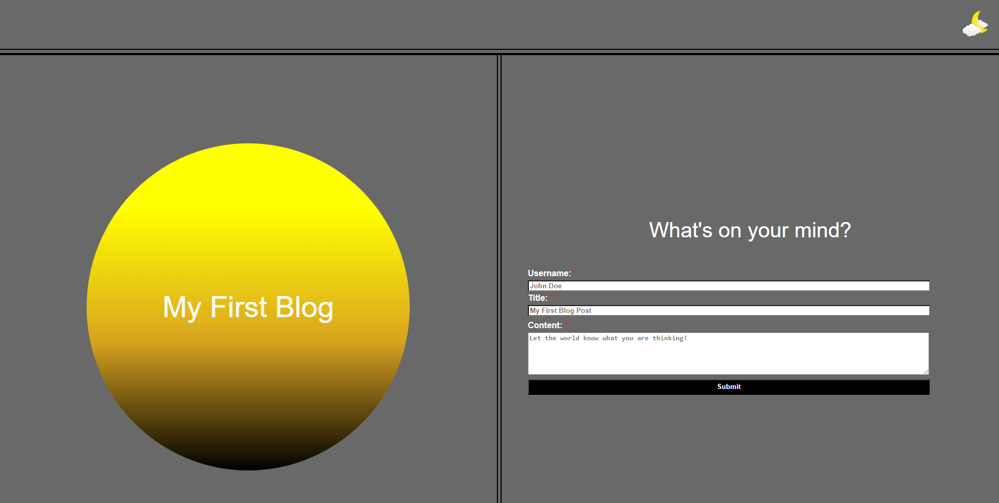
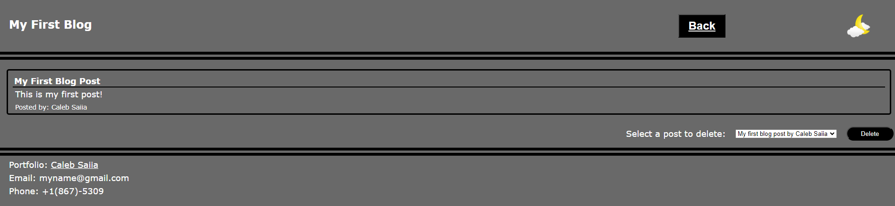

# Personal Blog Site

## Description

The personal blog site, uses local storage on your browser to track posts you have made and display them in a simple, but clean format.
All blog posts will be saved between sessions and allow users to view and delete previously made posts. Being able to look back at previous posts will give users the see what they have learned from their experiences over time and track the pace of their learning.

## Installation

No installation is required.

## Usage

 To use the site to its fullest, make sure that you first make a post. If you attempt to view posts when there are none, you wil be redirected to the landing page to share your thoughts in a new post. Fill out all of the fields on the form section of the landing page, and then submit using the button below the form. 
 
 
 
 Upon submitting the page will redirect to the list of posts. If you would like to return to make more posts you can click on the back button at the top of the page.

 

The image in the top right of both forms can be clicked to switch the style of the page between dark and light modes.
